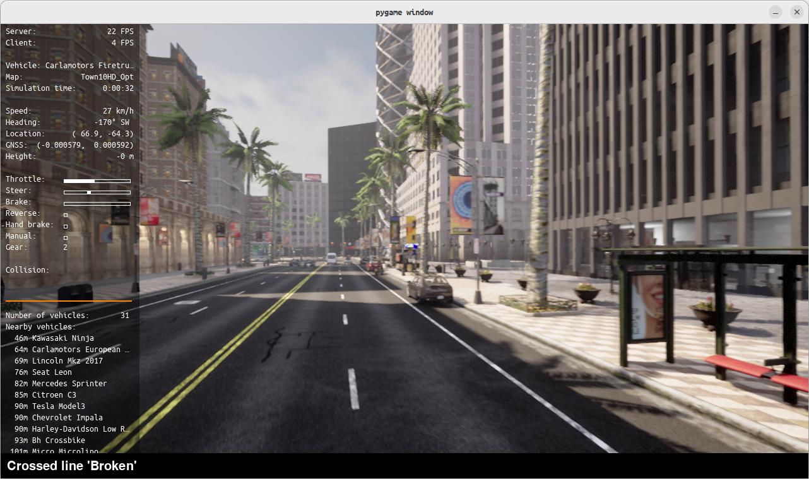
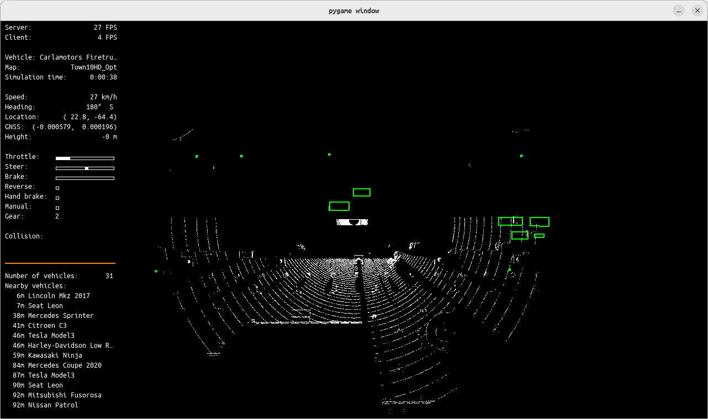

# EE267_LAB1: Perception
This project implements a 3D object detection pipeline for the CARLA simulator (v0.9.15). It includes scripts to generate traffic, run a self-driving agent, and evaluate a detection algorithm.

# Environment Setup (CARLA 0.9.16)

These instructions are for setting up a local Conda environment on Linux that is compatible with CARLA 0.9.15 and the Python scripts.

First step is to create a conda environment using miniconda. 

## 1. Create a Conda Environment

First, create a new Conda environment with Python 3.10. (If not already implemented)
```
conda create -n carla-lab python=3.10
conda activate carla-lab
```

## 2. Install Dependencies

With the environment active, install the necessary packages.
```
# Install the CARLA client (must match your server version)
pip install carla==0.9.15

# Install other required libraries for the agent and detector
conda install -c conda-forge numpy pygame scikit-learn
```

## 3. Graphics Driver Fix (Local Linux/NVIDIA Users)

The automatic_control.py script uses Pygame to render the simulation, which can conflict with Conda's graphics libraries and some system's (my local systems) NVIDIA drivers.

If you see a libGL error: MESA-LOADER: failed to open iris... error, it means the script is incorrectly trying to use the integrated Intel/AMD graphics.

To fix this, you must force the script to use your NVIDIA driver by pre-loading the correct library.

Find your NVIDIA libGL.so.1 path:
```
sudo find /usr -name "libGL.so.1" 2>/dev/null | grep nvidia
```

(This will output a path, e.g., /usr/lib/x86_64-linux-gnu/nvidia/current/libGL.so.1)

Use this path when you run the script (see "How to Run" below).

# How to Run

You will need three separate terminals for this project.

#### Terminal 1: Start the CARLA Server


Navigate to your CARLA installation directory and start the server.

## Example from a typical CARLA installation
```
./CarlaUE4.sh
```

#### Note: If you encounter an error related to missing OpenGL extensions or GLSL versions, try adding the following flags to CarlaUE4.sh:
```
./CarlaUE4.sh -opengl -ResX=1280 -ResY=720
```
Or if you need to specify to use the nvidia gpu on your system:
``` 
DRI_PRIME=1 ./CarlaUE4.sh
```

To improve system performance, you can consider running the simulation in lower resolution, or disalbing the server's graphical rendering entirely.
```
./CarlaUE4.sh -quality-level=Low -benchmark -fps=30
```

or
```
./CarlaUE4.sh -RenderOffScreen=True
```

### Terminal 2: Generate Traffic

In a new terminal, activate the Conda environment and run the traffic generator.

Recommended: Use the -w flag to reduce the number of walkers for better performance. The default is 200, which can cause low FPS.
```
conda activate carla-lab
```
This will spawn the default 30 vehicles but only 20 walkers
```
python generate_traffic.py -w 20
```

### Terminal 3: Run the Automatic Control Agent

In a third terminal, activate the environment and run the main agent script.

You must use the graphics driver fix from the setup section here.

Use python, not python3, to ensure you're using the Conda environment's interpreter.
```
conda activate carla-lab
```

### Run the agent with the graphics fix
(Replace the path with the one you found on your system)
```
__GLX_VENDOR_LIBRARY_NAME=nvidia LD_PRELOAD=/usr/lib/x86_64-linux-gnu/nvidia/current/libGL.so.1 python automatic_control.py --sync
```

### Using the Simulator Window

When automatic_control.py is running, a Pygame window will open.

Changing Views: You can cycle through the different sensor visualizations by pressing the TAB key. This will switch between the main Camera_Front view and the LIDAR_Top (Bird's-Eye-View) visualization.




### Detection Algorithm

The detector.py script implements a classic, non-deep-learning 3D object detection algorithm.

Algorithm: DBSCAN (Density-Based Spatial Clustering of Applications with Noise)

Source: The algorithm is provided by the scikit-learn Python library, a standard tool for machine learning.

### How it Works:

Input: A raw 3D point cloud is received from the top-mounted LIDAR sensor.

Ground Filter: The script first performs a height-based filter, removing all points that are part of the flat ground plane (e.g., all points with a z value less than -1.7 meters relative to the sensor).

Clustering: The remaining points (belonging to cars, pedestrians, etc.) are fed into the DBSCAN algorithm. DBSCAN finds dense groups of points and identifies them as individual clusters.

Bounding Box: A simple axis-aligned 3D bounding box (AABB) is generated around each cluster.

Output: A list of these bounding boxes (in the LIDAR's local coordinate frame) is returned to the agent for evaluation.